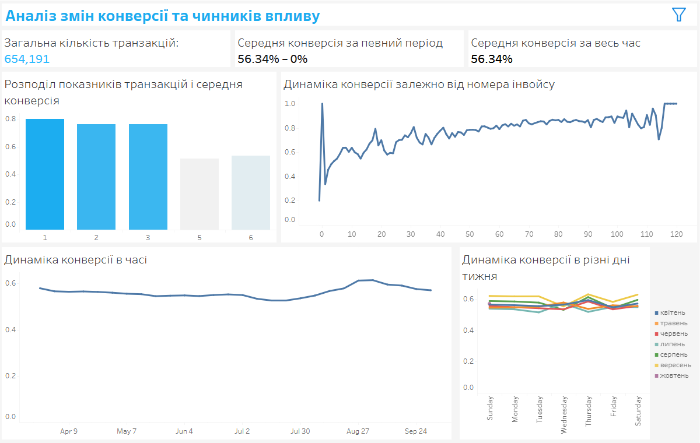

# Transaction Conversion Analysis
## Project Background
This project investigates the key factors that influence the success rate (conversion) of online payment transactions. The main objective is to identify which behavioral, transactional, or contextual variables affect whether a transaction is successful or not.

In online payments, even small shifts in conversion rates can significantly impact revenue, especially for high-volume merchants. By analyzing real transaction data and testing targeted hypotheses, this project aims to uncover both technical and behavioral drivers of payment success or failure.

The analysis evaluates a range of factors, including card characteristics (type, brand, issuing country), user behavior (number of emails, previous orders, retries), and contextual data (device type, invoice number, payment method, and IP/card country mismatch).

Insights and findings are presented across the following dimensions:

- **Card Features:** Assessing whether certain card brands (e.g., Visa vs Mastercard), card types (credit, debit, prepaid), or issuing countries show significantly different success rates.

- **User Behavior Patterns:** Investigating whether metrics like retry attempts, number of past orders, or the number of distinct emails associated with a user influence conversion.

- **Contextual and Device-Based Factors:** Analyzing how payment methods (Apple Pay, Google Pay, card), user device types, or mismatches between IP and card country affect outcomes.

- **Fraud-Related Signals:** Exploring how combinations of signals (e.g., country mismatch, many retries, or suspicious email behavior) may reduce conversion, potentially due to fraud prevention systems.

Each hypothesis is visualized in Tableau with corresponding conversion rates and tested using correlation metrics to quantify relationships. Visuals include bar charts, line plots, and distributions to support interpretation.

A full dashboard for interactive exploration of conversion patterns by card, behavior, and device is available [here](https://public.tableau.com/views/conversion_17533642227720/Dashboard3?:language=en-US&:sid=&:redirect=auth&:display_count=n&:origin=viz_share_link).

A structured summary of all tested hypotheses and interpretations is included in the main report [here](Testing%20hypotheses.pdf).

## Data Structure
The dataset used in this project consists of over 500,000 online payment transaction records. Each row corresponds to a single transaction attempt and includes over 30 features describing user behavior, card properties, device context, and transaction metadata.

The data structure includes:

- **Transaction Metadata:** fields like transaction ID, timestamp, success/failure status, retry number, and invoice number.

- **Card Information:** including card brand (Visa, Mastercard), type (credit, debit, prepaid), issuing country, and BIN-related data.

- **User and Device Features:**
* count_orders: number of previous successful orders by the user.
* count_emails: number of unique emails used by the user.
* device_type, payment_method: e.g., Apple Pay, Google Pay, Card.
* ip_country and card_country for geographic comparison.

- **Binary Flags and Derived Variables:**
* Mismatch between IP country and card country.
* Retry attempt count.
* Proxy for user experience via invoice number (higher number = later stage).

The target variable is transaction success (binary), which determines whether the payment went through successfully.

Initial data preprocessing involved:
- Type casting for categorical and numeric variables.
- Handling missing values and outliers (e.g., -1 for retry number).
- Creating binary flags for IP/card country match.
- Aggregating user-level features (e.g., total past orders).

The dataset can be found [here](./BillingOps-data.csv).

## Executive Summary
### Overview of Findings
This analysis explores behavioral and contextual factors that influence online payment success (conversion). Using a transactional dataset of 500K+ rows, we tested 15 hypotheses related to user behavior, card characteristics, geography, retry patterns, and device/payment methods.

Key findings include:

* **Card Type Matters**: Credit cards had the highest average success rate (≈0.60), followed by debit and prepaid cards. Prepaid cards consistently underperformed by over 15 percentage points.

* **Geographic Mismatch is Risky**: Transactions where the card country did not match the IP country had lower success rates (difference ≈0.05), potentially signaling fraud risk or insufficient trust.

* **Retry Behavior Signals Risk**: First attempts had the highest success rates. Each subsequent retry decreased the average success, with a clear downward trend, indicating reduced approval likelihood after failures.

* **Invoice Number (User Journey Proxy)**: Higher invoice numbers (i.e., later in the user journey) were associated with better conversion rates, suggesting that experienced users are more likely to complete payments successfully.

* **Order History Helps**: Users with more completed orders (higher `count_orders`) had slightly better success rates, supporting the idea that loyalty or trust increases over time.

* **Email Count as Risk Indicator**: Users with many different emails (`count_emails`) tended to have lower conversion rates, which may indicate risky behavior or fraud patterns.

* **Payment Method Differences**: While Apple Pay and Card had similar success rates, Google Pay trailed slightly behind. This might reflect differences in user behavior or implementation quality.

Overall, the results suggest that **user history, card type, geographic consistency, and retry patterns** are critical signals for predicting transaction outcomes. These findings can inform risk scoring, payment flow optimizations, and fraud prevention strategies.

An interactive Tableau dashboard was developed to explore all tested hypotheses and conversion trends across various user segments and payment attributes. You can explore the full dashboard [here](https://public.tableau.com/views/conversion_17533642227720/Dashboard3?:language=en-US&:sid=&:redirect=auth&:display_count=n&:origin=viz_share_link).

### Conversion Correlation

* **`bin_amount_usd` (Amount Group)** has the strongest negative correlation with payment success (≈ –0.30), confirming that **very large transactions tend to fail more often**. Success rates decline noticeably as payment amount increases.

* **`order_type`** (e.g., subscription, one-time) shows a moderate negative correlation (≈ –0.29), suggesting that **certain order types are less likely to be approved**, possibly due to higher risk or different processing rules.

* **`channel_id`** correlates negatively (≈ –0.25), meaning the channel or platform through which the payment is made impacts approval rate. **Some channels consistently underperform**, potentially due to integration quality or user experience.

These results support the idea that **monetary amount, transaction type, and payment channel** are primary structural factors influencing conversion.

### Card & Payment Method Dynamics

* **`card_type`** (credit, debit, prepaid) shows clear differences: **credit cards have the highest pass rate**, while prepaid cards are significantly riskier. Correlation is weak globally (–0.07), but effect size is visible in averages.

* **`merchant_token_type`** has a weak correlation (–0.13), meaning token type alone doesn’t reliably predict success, but may carry contextual risk patterns.

* **`payment_tool`** (Apple Pay, Google Pay, Card) has near-zero correlation (–0.016), suggesting **payment tool doesn’t meaningfully impact success**, though averages show slight variation.

* **`has_3ds`** (3D Secure) also lacks strong effect (–0.10), meaning **3D Secure presence alone is not a strong predictor**, though it may work better in combination with other features.

In summary, **card type is the most useful signal** within this group. Other features may contribute marginally or only in interaction with broader patterns.

### Geography & Risk Signals

* **`card_country`** and **`ip_card_country_match`** have weak negative correlations (≈ –0.02), meaning that **geographic mismatch alone doesn’t guarantee failure**, but still aligns with slightly lower success.

* **`retry_number`** has a slightly **positive correlation** (0.014), counterintuitively suggesting retries might marginally help — though in practice, average success clearly drops with more retries.

* **`invoice_number`** shows a **positive correlation (0.24)** — users with more experience (higher invoice numbers) are more likely to succeed, supporting **user-level maturity effects**.

* **`count_orders`** has a weak negative correlation (–0.05), contradicting expectations. Possibly due to outliers or bot activity in high-order users.

* **`count_emails`** has a **weak positive correlation (0.066)**, which may be misleading. Still, **users with many emails may be risky**, as seen in failure clusters.

These variables provide **mixed signals**, but experience-based proxies (`invoice_number`) are the most reliable in predicting success.

### Recommendations
1. **Monitor Transaction Amounts for Risk**
Payments with larger amounts (especially over \$500) show a significantly lower success rate. Merchants should implement amount-based risk checks and consider requesting additional verification for high-value transactions. Segmenting payment strategies based on price tiers may improve conversion.

2. **Favor Credit Over Prepaid Cards**
Credit cards demonstrate the highest approval rates, while prepaid and virtual cards underperform. Whenever possible, encourage users to use credit or debit cards, and flag prepaid types for further scrutiny or fallback options.

3. **Optimize for Reliable Channels**
Certain payment channels consistently perform better than others. Focus technical and business improvements (e.g., integration quality, error monitoring) on underperforming channels. If channel data is available early in the flow, prioritize routing through historically high-conversion paths.

4. **Use Card Country Signals Carefully**
Although card country and IP mismatches weakly correlate with failures, they still represent potential fraud patterns. Consider using these features in a combined risk model rather than standalone rules.

5. **Leverage Customer History**
Users with higher invoice numbers — i.e., repeat users — have substantially better success rates. Reward and prioritize them through streamlined flows and relaxed fraud thresholds. Building user trust and experience over time pays off in conversion.

6. **Limit Retry Attempts**
While correlation is slightly positive, deeper analysis reveals conversion drops with each additional retry. Retry strategies should include exponential backoff and possibly restrict more than 2 failed attempts within a short period.

7. **Flag Suspicious Email Behavior**
A high number of email addresses associated with a user may indicate suspicious behavior. Set thresholds for acceptable email variation and include email volume as a feature in fraud or conversion scoring.

These recommendations focus on **conversion optimization** and **fraud risk mitigation**. They can guide product, risk, and ops teams in **prioritizing interventions, personalizing flows**, and improving overall approval rates.

